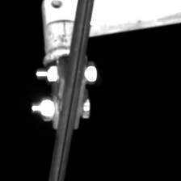
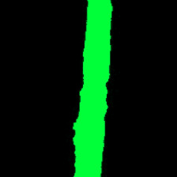

#参考来源:https://github.com/BBuf/Keras-Semantic-Segmentation
#参考数据集:个人制作的2分类小数据集
#Keras-Sematic-Segmentation
#在原模型基础上增加了Deeplabv3模型(因为用的Xception,数据集尽量要大才好\否则会过拟合)

使用Keras实现深度学习中的一些语义分割Deeplabv3模型和unet模型。

# 配置
- tensorflow 1.8.0
- keras 2.2.4
- GTX 2070/CPU
- opencv

# 目录结构

- data 存储输入图像和语义分割标签的文件夹
```
- data
	- dataset_name
		- train_image
		- train_label
		- test_image
		- test_label
```

- Models 存储使用keras实现的一些经典分割模型
- utils 存储工具代码，如数据预处理
- data.py 加载1个batch的原始图片和分割标签图片
- train.py 模型训练
- test.py 模型测试
# 已支持的分割模型

|Epoch|model_name|Base Model|Segmentation Model|Available|
| ---|---|---|---|---|
|50|Deeplabv3|Xception|Deeplabv3|True|
|50|unet|Vanilla CNN|UNet|True|


# 训练

使用下面的命令训练和保存模型，模型保存路径，训练超参数需要灵活设置。
训练权重:链接：https://pan.baidu.com/s/1TwP-hILunrzYvERy0yZjaw 提取码：4c7k
下载后加入于/weights/Deeplabv3/ 文件夹
若要基于此训练权重训练的话则同时在train.py里面修改:
parser.add_argument("--resume", type=str, default="weights/Deeplabv3/Deeplabv3.22-0.995500.hdf5")

```sh
python train.py 
```

可用参数如下：

- `--dataset_name` 字符串，代表选择对应的数据集的名称，默认streetscape
- `--n_classes` 整型，代表分割图像中有几种类别的像素，默认为`2`。
- `--input_height`整型，代表要分割的图像需要`resize`的长，默认为`224`。
- `--input_width` 整型，代表要分割的图像需要`resize`的宽，默认为`224`。
- `--resize_op` 整型，代表`resize`的方式，如果为`1`则为默认`resize`，如果为2，则为`letterbox_resize`。
- `--validate`布尔型，代表训练过程中是否需要验证集，默认为`True`，即使用验证集。
- `--epochs`整型，代表要训练多少个`epoch`，默认为`50`。
- `--train_batch_size`整型，代表训练时批量大小，默认为`4`。
- `--model_name ` 字符串类型，代表训练时使用哪个模型，支持`enet`,`unet`,`segnet`,`fcn8`等多种模型，默认为`unet`。
- `--train_save_path`字符串类型，代表训练时保存模型的路径，默认为`weights/unet`，即会将模型保存在`weights`文件夹下，并且每个模型名字前缀以`unet`开头，后面接迭代次数和准确率构成完整的保存模型的路径。
- `--resume`字符串类型，代表继续训练的时候加载的模型路径，默认值为``，即从头训练。
- `--optimizer_name`字符串类型，代表训练模型时候的优化方法，支持`sgd`,`adam`,`adadelta`等多种优化方式，默认为`adadelta`。
- `--image_init`字符串类型，代表输入图片初始化方式，支持`sub_mean`，`sub_and_divide`，`divide`，默认为`sub_mean`。


# 训练示例

- 训练本工程提供的二分类数据集：`python train.py  --model_name Deeplabv3 --image_init divide --n_classes 2`


# 测试

使用下面的命令测试模型，加载模型的路径，图像输入分辨率等参数需要灵活设置。

```sh
python test.py
```

可用参数如下：

- `--test_images`字符串类型，代表测试图所在的文件夹路径，默认为`data/test/`。
- `--output_path`字符串类型，代表从测试图预测出的`mask`图输出路径，默认为`data/output/`。
- `--model_name` 字符串类型，代表测试时使用哪个模型，支持`enet`,`unet`,`segnet`,`fcn8`等多种模型，默认为`unet`。
- `--weights_path`字符串类型，代表预测时加载的模型权重，默认为`weights/unet.18-0.856895.hdf5`，即对应默认模型`unet`训练出来的模型权重。
- `--input_height`整型，代表测试集输入到网络中需要被`resize`的长，默认为`224`。
- `--input_width`整型，代表测试集输入到网络中需要被`resize`的宽，默认为`224`。
- `--resize_op` 整型，代表`resize`的方式，如果为`1`则为默认`resize`，如果为2，则为`letterbox_resize`。
- `--classes`整型，代表图片中的像素类别数，默认为`2`。
- `--mIOU`布尔型，代表是否启用评测`mIOU`，默认为`False`，一旦启用需要提供带有`mask`图的测试数据集。
- `--val_images`字符串类型，代表启用`mIOU`后测试集原图的路径，默认为`data/val_image/`。
- `--val_annotations`字符串类型，代表启用`mIOU`后测试集`mask`图的路径，默认为`data/val_label/`。
- `--image_init`字符串类型，代表输入图片初始化方式，支持`sub_mean`，`sub_and_divide`，`divide`，默认为`sub_mean`。


# 测试示例

- 测试二分类数据集：`python test.py --model_name  Deeplabv3 --weights_path weight/Deeplabv3.xx.hdf5 --classes 2 --image_init divide`


# 数据集

数据集制作使用`Labelme`即可，然后将得到的`json`文件使用`json_to_dataset.py`转换为本工程要用的`mask`标签图，具体操作步骤为：

-  使用本工程中的`json_to_dataset.py`替换掉`labelme/cli`中的相应文件—`json_to_dataset.py` 。在`cmd`中输入`python json_to_dateset.py  /path/你的json文件夹的路径`。注意是把每张图的`json`文件都放在一个目录下，`labelme`标注出来的默认是一张图片一个文件夹。
- 运行后，在`json`文件夹中会出现`mask_png、labelme_json`文件夹，`mask_png`中存放的是所有8位掩码文件！也即是本工程中使用的标签图。
- 具体来说，我们的标签图就是分别指示每张图片上每一个位置的像素属于几，`0`是背景，然后你要的类别从`1`开始往后递增即可。
- 本工程测试的一个2类的简单分割数据集，原作者数据集为：https://pan.baidu.com/s/1sVjBfmgALVK7uEjeWgIMug


## 个人制作2个类别小零件数据集分割可视化结果

|     Input Image      | Output Segmentation Image |
| :------------------: | :-----------------------: |
|  |    |


## TODO

- 支持DeepLab，UNet++等。
- 支持OpenVINO和TensorRT部署。
- 有疑问请直接联系:1602881391@qq.com
